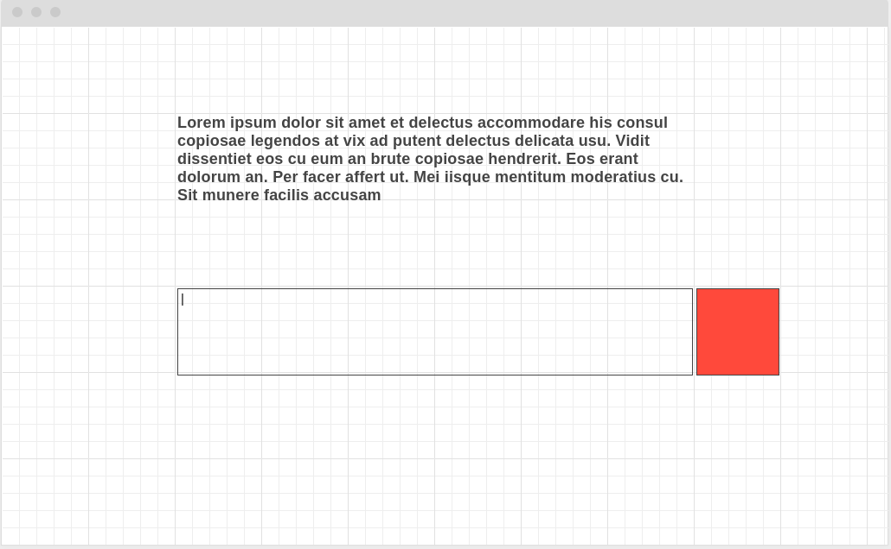
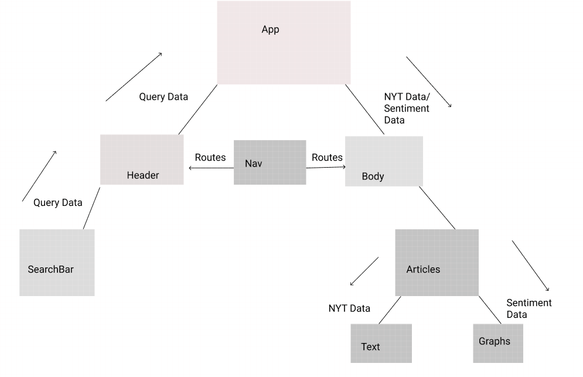

# Article Sentiment

## Project Description

This app will display word analysis using Indico's Sentiment automation for text processing. The user will enter in a word or a sentence and receive articles based on the New York times API as well as data visualization.

## Wireframes

### Mobile Wireframes:


### Desktop Wireframes




## API Snippet

https://indico.io/blog/docs/indico-api/quickstart/

```
{
  "results": {
    "anger": 0.03221449628472328,
    "fear": 0.09735360741615295,
    "joy": 0.47539448738098145,
    "sadness": 0.24594545364379883,
    "surprise": 0.14909198880195618
  }
}
```

https://developer.nytimes.com/

```
{
  "status": "OK",
  "copyright": "Copyright (c) 2019 The New York Times Company. All Rights Reserved.",
  "response": {
    "docs": [
      {
        "web_url": "https://www.nytimes.com/2019/07/29/us/politics/on-politics-democratic-debates-preview.html",
        "snippet": "Democrats are gearing up for what’s expected to be a far more contentious face-off than the first debates."
      },
      {
        "web_url": "https://www.nytimes.com/2019/09/04/us/politics/lewandoski-trump-senate.html",
        "snippet": "Corey Lewandowski, President Trump’s former campaign manager, is echoing his onetime boss as he weighs a run for the Senate in New Hampshire. Some Republicans are shuddering."
      },
      {
        "web_url": "https://www.nytimes.com/2019/08/06/us/politics/shootings-el-paso-dayton-trump.html",
        "snippet": "President Trump addressed the country after mass shootings in El Paso and Dayton, Ohio, but he stopped short of endorsing broad gun control measures."
      },
      {
        "web_url": "https://www.nytimes.com/2019/08/23/us/politics/joe-biden-candidate.html",
        "snippet": "There are signs of a disconnect between support for Joe Biden in polls and excitement for his campaign on the ground in Iowa."
      },
      {
        "web_url": "https://www.nytimes.com/2019/09/20/world/europe/ukraine-trump-zelensky.html",
        "snippet": "Pressure on the Ukrainian government by President Trump’s personal lawyer, Rudolph W. Giuliani, has been an open secret in Kiev, the Ukrainian capital, for months."
      },
      {
        "web_url": "https://www.nytimes.com/2019/09/13/opinion/letters/alexandria-ocasio-cortez-aoc-abc.html",
        "snippet": "A Catholic nun is shocked that ABC would run an ad with “horrific images” during the Democratic debate."
      },
      {
        "web_url": "https://www.nytimes.com/2019/08/17/travel/in-dc-trading-politics-for-a-paddle.html",
        "snippet": "The Potomac River offers a watery vantage point on the nation’s capital, with some rocky shoals."
      },
      {
        "web_url": "https://www.nytimes.com/2019/07/04/opinion/sunday/politics-new-religion.html",
        "snippet": "It’s offensive to both politics and religion."
      },
      {
        "web_url": "https://www.nytimes.com/2019/08/19/us/politics/trump-economic-conspiracy.html",
        "snippet": "As the economy shows ominous signs, the president has started to blame outside forces conspiring against him."
      },
      {
        "web_url": "https://www.nytimes.com/2019/07/30/us/politics/democratic-debate.html",
        "snippet": "For half of the candidates, it may be their last chance to make an impression on the national stage."
      }
    ],
    "meta": {
      "hits": 1049311,
      "offset": 10,
      "time": 211
    }
  }
}
```

#### MVP

- Use New York times API to analyze articles
- Render data on page
- Add Responsiveness for Phone
- - Mount data to Highcharts for charting

#### PostMVP

- Add animations while rendering using React.Spring
- Implement color hash to generate background color

## React Component Hierarchy



## Priority Matrix


### Priorities

- A: Working search bar
- B: Successfully grab JSON and store into reusable data structures
- C: Apply searches to INDICO API & NYT API
- D: Render data using text
- E: Render data through Highcharts
- F: Add styling


| Day      | Deliverable                                      | Status     |
| -------- | ------------------------------------------------ | ---------- |
| Sep 30th | Scaffolding Project/Routes/Make a working Search Bar | Unfinished   |
| Oct 1st | Apply search input to Api/Render Data through text | Unfinished   |
| Oct 2nd | Render data using HighCharts           | Unfinished   |
| Oct 4th |Styling with breakpoints           | Unfinished   |
| Oct 5th | Present                      | Unfinished   |

| Component                    | Priority | Estimated Time | Time Invetsted | Actual Time |
| ---------------------------- | :------: | :------------: | :------------: | :---------: |
| Scaffolding Project/Routes   |    H     |      3hrs      |                |             |
| Make a working search bar    |    H     |      3hrs      |                |             |
| Apply search to API call     |    H     |      4hrs      |                |             |
| Render Data through Text     |    H     |      4hrs      |                |             |
| Render Data using HighCharts |    H     |      8hrs      |                |             |
| Add styling to page          |    H     |      8hrs      |                |             |
| Total                        |    H     |     30hrs      |                |             |

## Additional Libraries

Fomatic for utility styling https://fomantic-ui.com/

Highcharts for chart generation https://www.highcharts.com/

## Code Snippet

## Issues and Resolutions

**ERROR**:  
**RESOLUTION**:
