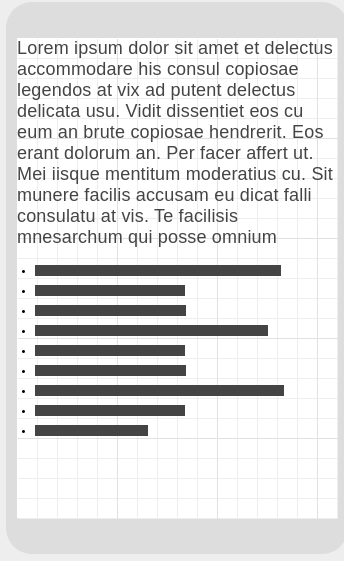
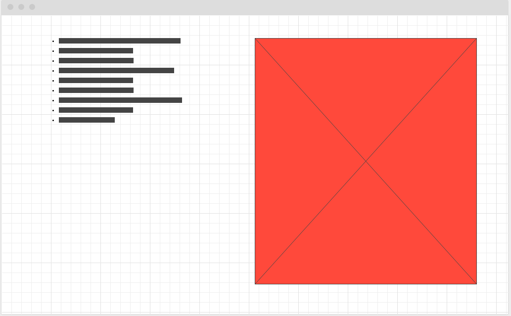
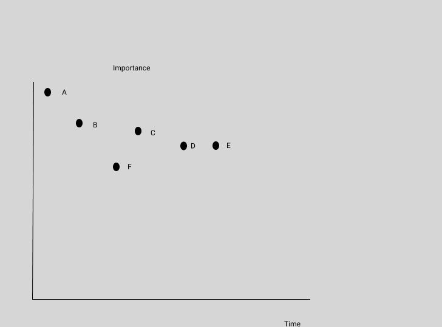

# Article Sentiment

## Project Description

This app will display word analysis using Indico's Sentiment automation for text processing. The user will enter in a word or a sentence and receive text analysis as well as data visualization using Highchart.js.

## Wireframes

### Mobile Wireframes:




### Desktop Wireframes




## API Snippet

https://indico.io/blog/docs/indico-api/quickstart/

```
{
  "results": {
    "anger": 0.03221449628472328,
    "fear": 0.09735360741615295,
    "joy": 0.47539448738098145,
    "sadness": 0.24594545364379883,
    "surprise": 0.14909198880195618
  }
}
```
https://developer.nytimes.com/
```
{
  "status": "OK",
  "copyright": "Copyright (c) 2019 The New York Times Company. All Rights Reserved.",
  "response": {
    "docs": [
      {
        "snippet": "Democrats are gearing up for what’s expected to be a far more contentious face-off than the first debates."
      },
      {
        "snippet": "Corey Lewandowski, President Trump’s former campaign manager, is echoing his onetime boss as he weighs a run for the Senate in New Hampshire. Some Republicans are shuddering."
      },
      {
        "snippet": "President Trump addressed the country after mass shootings in El Paso and Dayton, Ohio, but he stopped short of endorsing broad gun control measures."
      },
      {
        "snippet": "There are signs of a disconnect between support for Joe Biden in polls and excitement for his campaign on the ground in Iowa."
      },
      {
        "snippet": "Pressure on the Ukrainian government by President Trump’s personal lawyer, Rudolph W. Giuliani, has been an open secret in Kiev, the Ukrainian capital, for months."
      },
      {
        "snippet": "A Catholic nun is shocked that ABC would run an ad with “horrific images” during the Democratic debate."
      },
      {
        "snippet": "The Potomac River offers a watery vantage point on the nation’s capital, with some rocky shoals."
      },
      {
        "snippet": "It’s offensive to both politics and religion."
      },
      {
        "snippet": "As the economy shows ominous signs, the president has started to blame outside forces conspiring against him."
      },
      {
        "snippet": "For half of the candidates, it may be their last chance to make an impression on the national stage."
      }
    ],
    "meta": {
      "hits": 1049307,
      "offset": 10,
      "time": 234
    }
  }
}
```

#### MVP

- Find and use external api
- Render data on page
- Mount data to highcharts for charting
- Add Responsiveness for Phone
- Use New York times API to analyze articles

#### PostMVP

- Add animations while rendering
- Implement color hash to generate background color

## React Component Hierarchy

/App ||

//Header => SearchBar||


//Body => 

Graphs | 

AnalysisText => Text

## Priority Matrix



### Priorities

- A: Working search bar
- B: Successfully grab JSON and store into reusable data structures
- C: Apply searches to INDICO API call
- D: Render data using text
- E: Render data through Highcharts
- F: Add styling

| Component                    | Priority | Estimated Time | Time Invetsted | Actual Time |
| ---------------------------- | :------: | :------------: | :------------: | :---------: |
| Scaffolding Project/Routes          |    H     |     1hr      |                |             |
| Make a working search bar    |    H     |      3hrs      |                |             |
| Apply search to API call     |    H     |      4hrs      |                |             |
| Render Data through Text     |    H     |      2hrs      |                |             |
| Render Data using HighCharts |    H     |      7hrs      |                |             |
| Add styling to page          |    H     |      7hrs      |                |             |
| Total                        |    H     |     23hrs      |      5hrs      |    5hrs     |

## Additional Libraries

Fomatic for utility styling https://fomantic-ui.com/

Highcharts for chart generation https://www.highcharts.com/

## Code Snippet

## Issues and Resolutions

**ERROR**:  
**RESOLUTION**:
